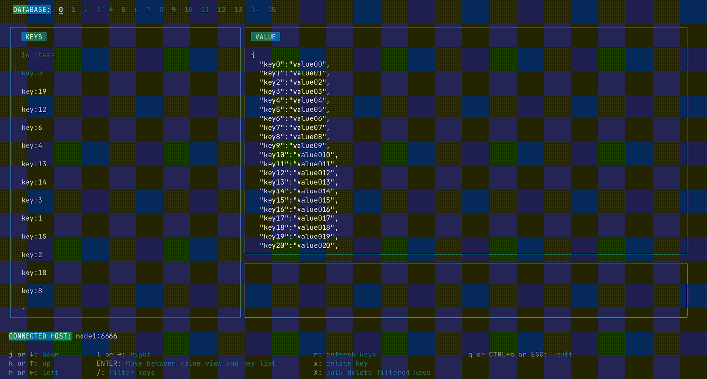

# red

Yet another Redis client TUI, forcused on development purpose.



> [!IMPORTANT]
> This is a tool specifically for development and debugging. It is NOT suitable for production use.

red is a redis client TUI application dev tool tailored for my own use case, which is to quickly view Redis keys and values.

### Features

- List keys. View values.
- Filter and bulk delete keys.

### Limitations and things good to know

- It does not support all Redis commands, data types (it doesn't even support SET currently).
- It uses KEYS command to fetch all the keys in database (not suitable for production).
- It doesn't support Windows (yet).
- And it might not run on your system, but does on mine 😉.

## Installation

Via Homebrew:

```bash
brew install hirotake111/tap/red
```

Or, you can build from source:

```sh
git clone 
make build
mv ./bin/red <path to a directory you like to put the binary>
```

## Specifying Redis Connection Parameters

This application connects to a Redis server using connection parameters specified via environment variables:

- `REDIS_URL`
    - The URL or address of the Redis server. If not set, defaults to `redis://localhost:6379`.

You can set the environment variable above before running the application to connect to a different Redis server.

### TODOs

- Update pretty function to make JSON look better.
- SET command support (maybe).
- Cache values to avoid fetching them again when selected repeatedly.
